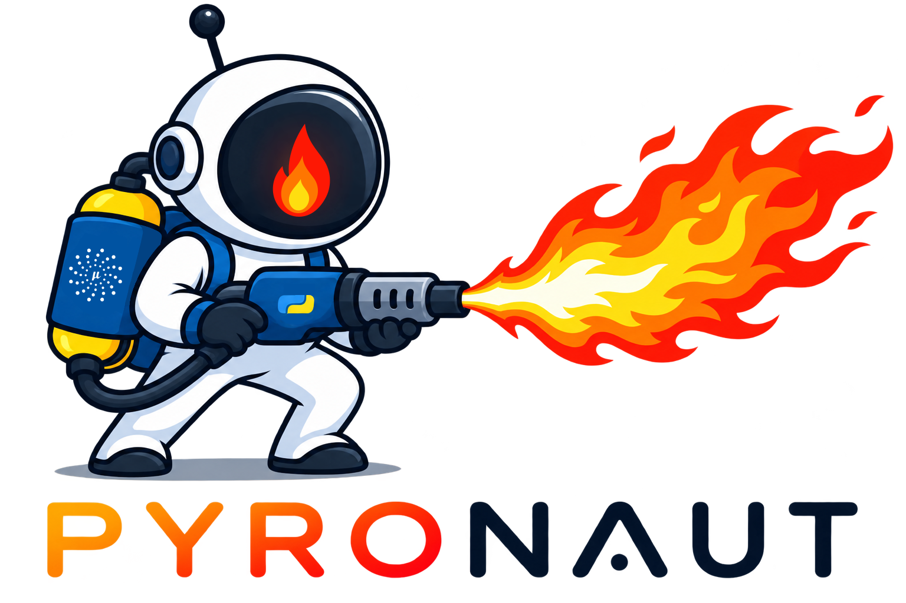

# Pyronaut

Pyronaut is a polyglot runtime for running Python and Java code built on the Micronaut programming model. Python and Java code can combine seamlessly and utilize Micronaut features like dependency injection, AOP, configuration properties, serialization and so on.

For Python developers Pyronaut is a viable alternative to frameworks like FastAPI built on one of the most popular and mature frameworks in the Java ecosystem and highly scalable thanks to Netty.

For Java developers Pyronaut provides a faster GraalVM crema-based development model that allows easily incorporating Python code using GraalPy.

The main user entry point is the `pyronaut` command. The command is a Python
orchestrator that delegates to focused JVM/native tools for dependency
resolution, source processing, application execution, tests, configuration
validation, native builds, and test resources.

## What is in this repository?

This repository contains the Pyronaut CLI and the Micronaut integration modules
that make Python applications work with Micronaut:

- `pyronaut`: the packaged Python CLI orchestrator and SDK wheel.
- `pyronaut-install`: resolves Maven dependencies, writes classpath manifests,
  generates configuration schemas, and creates IDE stubs.
- `pyronaut-processor`: processes Python and Java sources into Micronaut
  metadata/classes.
- `pyronaut-dev`: runs applications in development mode with automatic
  install/process preflight.
- `pyronaut-run` and `pyronaut-test`: run applications and pytest-backed tests.
  templates.
- `pyronaut-validate-config`: validates Micronaut configuration for run, test,
  and production scenarios.
- `pyronaut-test-resources-server`: manages Micronaut Test Resources for local
  development and tests.
- `pyronaut-native-build`: builds native executables.
- `pyronaut-tui`: interactive terminal UI over the same CLI workflow.
  support.
- `pyronaut-pytest`, `pyronaut-requests`, `pyronaut-logging`, and
  `pyronaut-logback`: runtime and testing support libraries.

The full user guide lives in `src/main/docs/guide`.

## Getting started from a source checkout

These instructions build the Pyronaut CLI from this repository. The tested
local setup uses GraalVM Community Edition `25.1.3+9.1` and GraalPy `3.12.8`
from Oracle GraalVM Native 25.1.3. GraalVM Enterprise Edition should also
work, but the Community Edition setup is the one currently replicated by the
project maintainers.

### 1. Install the prerequisites

Install GraalVM CE `25.1.3+9.1` from the
[GraalVM 25.1.3 releases](https://github.com/graalvm/graalvm-ce-builds/releases#release-graal-25.1.3).
On macOS, use the `aarch64` bundle, extract it, and set `JAVA_HOME` to the
JDK's `Contents/Home` directory. On Linux, choose the bundle matching your
machine's architecture:

```bash
export JAVA_HOME="/path/to/graalvm-community-25.1.3/Contents/Home"
java -version
```

The output should identify GraalVM CE `25.1.3+9.1`. Set `JAVA_HOME` in the
same shell where you run Gradle.

Install `pyenv` if it is not already available:

```bash
brew install pyenv

echo 'export PYENV_ROOT="$HOME/.pyenv"' >> ~/.zshrc
echo '[[ -d "$PYENV_ROOT/bin" ]] && export PATH="$PYENV_ROOT/bin:$PATH"' >> ~/.zshrc
echo 'eval "$(pyenv init - zsh)"' >> ~/.zshrc

source ~/.zshrc
```

Install GraalPy `3.12.8` (`graalpy3.12-25.1.3`) with `pyenv`:

```bash
pyenv install --list | grep graalpy
pyenv install graalpy3.12-25.1.3
pyenv shell graalpy3.12-25.1.3

python --version
```

If `pyenv install` reports that the version is already installed, select it
with `pyenv shell graalpy3.12-25.1.3` instead. If you do not have `pyenv`, ask
your coding assistant to install and configure it for your shell.

### 2. Build the Pyronaut CLI

Clone the repository and select the GraalPy environment used by the Gradle
wheel task:

```bash
git clone https://github.com/micronaut-projects/pyronaut.git
cd pyronaut
export PYENV_VERSION=graalpy3.12-25.1.3
```

Build the SDK wheel:

```bash
./gradlew :micronaut-pyronaut:buildSdkWheel \
  --stacktrace \
  --refresh-dependencies
```

The `--refresh-dependencies` option is intentional. It helps avoid
compilation errors caused by a version mismatch between a Micronaut Core
snapshot downloaded from the Maven snapshots repository and the checked-out
Pyronaut sources.

The wheel is written to:

```text
pyronaut/pyronaut/build/wheel/dist/
```

### 3. Install the CLI

Choose one of the following options.

#### Option 1: Install into the active pyenv environment

This uses the `PYENV_VERSION` selected above and installs the wheel into that
environment:

```bash
./gradlew :micronaut-pyronaut:installSdkWheel
pyronaut --help
pyronaut --version
pyronaut setup
```

The help command should print the CLI usage. The version command currently
prints:

```text
Pyronaut: 0.0.1-SNAPSHOT
Micronaut Core: 5.2.0-SNAPSHOT
Micronaut Platform: 5.1.0
GraalPy: 25.1.3
Native Image JDK: 25
```

The Pyronaut, Micronaut Core, and platform versions may change as the
repository evolves.

#### Option 2: Install into a project-local virtual environment

Use this option when you want the CLI isolated to a demo application. Run the
commands from the demo application's directory, outside the Pyronaut checkout:

```bash
python3 -m venv .venv-pyronaut-sdk
source .venv-pyronaut-sdk/bin/activate
python -m pip install --upgrade pip
python -m pip install /absolute/path/to/pyronaut/pyronaut/build/wheel/dist/pyronaut-0.0.1.dev0-py3-none-any.whl
pyronaut --help
pyronaut --version
pyronaut setup
```

Replace `/absolute/path/to/pyronaut` with the full path to the checkout where
you built the wheel. For example, if the checkout is under `~/Code/pyronaut`,
use `/Users/your-user/Code/pyronaut` as the corresponding absolute path.

If you rebuild the wheel, reinstall the new wheel into the virtual environment:

```bash
python -m pip install --force-reinstall /absolute/path/to/pyronaut/pyronaut/build/wheel/dist/pyronaut-0.0.1.dev0-py3-none-any.whl
```

### Test prerequisite: pytest in GraalPy

`pyronaut test` requires `pytest` to be installed in the GraalPy environment
used by Pyronaut. Pyronaut does not install Python packages automatically, and
a CPython virtual environment cannot provide packages to the embedded GraalPy
runtime.

If the CLI is installed into the active pyenv environment (Option 1), install
pytest into that active environment. If the CLI is project-local (Option 2),
use the project-local environment described below. For a separate project
environment, create and activate a GraalPy virtual environment from the
hello-world directory:

For Option 1:

```bash
python -m pip install --upgrade pip pytest
python -m pytest --version
```

For a separate project environment:

```bash
graalpy -m venv .venv
source .venv/bin/activate
python -m pip install --upgrade pip pytest
python -m pytest --version
```

If you are using Option 2 and installed the CLI into `.venv-pyronaut-sdk`,
activate that environment and install `pytest` into it instead of creating a
second environment:

```bash
source .venv-pyronaut-sdk/bin/activate
python -m pip install --upgrade pip pytest
python -m pytest --version
```

## CLI at a glance

```bash
pyronaut [--version] [--tui [--smoke|--non-interactive]] \
  <install|process|dev|run|test|build|create|validate-config|test-resources-server> [args...]
```

Current platform support is macOS and Linux. Commands that delegate to the JVM
require a compatible GraalVM JDK; the CLI can discover local GraalVM
installations or provision configured toolchains.

## Typical project layout

Pyronaut reads project settings from `pyproject.toml`.

Default directories are:

```text
src            Python application sources
tests          Python tests
src-java       optional Java application sources
test-java      optional Java test sources
config         Micronaut application resources
tests-config   Micronaut test resources
__pyronaut__   generated Pyronaut state, reports, caches, and manifests
```

A minimal `pyproject.toml` looks like this:

```toml
[project]
name = "hello-pyronaut"
version = "0.1.0"
dynamic = ["scripts"]

[build-system]
requires = ["setuptools", "wheel", "tomli"]
build-backend = "setuptools.build_meta"

[tool.pyronaut]
repositories = [
  "https://s01.oss.sonatype.org/content/repositories/snapshots/",
  "mavenCentral"
]

[tool.pyronaut.dependencies]
runtime = [
  "io.micronaut:micronaut-http-server-netty",
  "io.micronaut:micronaut-json-core",
  "io.micronaut:micronaut-jackson-databind",
  "ch.qos.logback:logback-classic"
]
build = []
test = [
  "io.micronaut.pyronaut:micronaut-pyronaut-pytest",
  "io.micronaut.test:micronaut-test-junit5",
  "io.micronaut.pyronaut:micronaut-pyronaut-requests"
]
```

Custom source directories can be configured with:

```toml
[tool.pyronaut.sources]
python = "app"
python-test = "test/python"
java = "src/main/java"
java-test = "src/test/java"
resources = "app-config"
test-resources = "tests-config"
additional-resources = ["views", "assets"]
additional-test-resources = ["test-fixtures"]
```

## Hello-world application

Create the hello-world application in its own directory outside the Pyronaut
checkout. Run the following commands from the parent directory of the
checkout:

### 1. Create the application directory

```bash
mkdir -p hello-world
cd hello-world
```

All application, installation, run, and test commands in this section are run
from the `hello-world` directory.

### 2. Create `pyproject.toml`

Create `pyproject.toml` in the `hello-world` directory using the minimal
example shown in [Typical project layout](#typical-project-layout) above.
The snapshots repository is required because this source checkout uses
Micronaut Core `5.2.0-SNAPSHOT`, which is not published to Maven Central.

### 3. Add a controller

Create `src/controllers.py`:

```python
from micronaut.http.annotation import Get


@Get(value="/", produces="text/plain")
def index() -> str:
    return "Hello from Pyronaut"
```

### 4. Add application configuration

Create `config/application.toml`:

```toml
[micronaut.application]
name = "hello-pyronaut"

[micronaut.server]
port = 8080
```

### 5. Run the application

Run the application in development mode:

```bash
pyronaut install
```

After `pyronaut install` succeeds, process the sources and start development
mode:

```bash
pyronaut process
pyronaut dev
```

Wait for `pyronaut install` to resolve every scope before running
`pyronaut process`. A successful install resolves build, runtime,
development-runtime, test, and test-resources-server dependencies, then
generates the application schema and Python editor stubs. Dependency counts
vary, but the output has this shape:

```text
Resolved build dependencies (... artifacts)
Resolved runtime dependencies (... artifacts)
Resolved development-runtime dependencies (... artifacts)
Resolved test dependencies (... artifacts)
Resolved test-resources-server dependencies (... artifacts)
Generated application schema from runtime classpath (... fragments)
Generated Python editor stubs (... packages, ... symbols)
```

The `SLF4J(W)` messages about no providers are warnings from the install
process and do not indicate a failed dependency resolution.

If any scope reports `Dependency resolution failed`, treat `pyronaut install`
as unsuccessful and do not continue to `pyronaut process`. Processing then
fails with `Missing build scope cache` because installation did not write the
required `__pyronaut__/resolved-build-dependencies` manifest. Fix the
dependency or repository configuration and rerun `pyronaut install`.

`pyronaut dev` performs install/process preflight automatically, so after the
first successful install this is normally enough:

```bash
pyronaut dev
curl http://localhost:8080/
```

### 6. Add and run a test

Create `tests/test_controller.py`:

This test uses the Pyronaut Requests integration. Its
`io.micronaut.pyronaut:micronaut-pyronaut-requests` dependency is included in
the `test` dependencies in the `pyproject.toml` example above.

```python
import pytest
import requests

from pyronaut.test import MicronautTest, micronaut_test_fixture


@pytest.fixture
def my_context(request):
    fixture = micronaut_test_fixture(request, MicronautTest())
    yield fixture
    fixture.stop()


@pytest.fixture
def client(my_context):
    return requests.with_context(my_context)


def test_index(client):
    response = client.get("/")
    assert response.status_code == 200
    assert response.text == "Hello from Pyronaut"
```

Run tests through Pyronaut so the Micronaut classpath and pytest engine are set
up consistently:

```bash
pyronaut test
```

Reports are written under `__pyronaut__/reports/tests`.

### Troubleshooting

If `pyronaut install` reports `Dependency resolution failed`, do not continue
to `pyronaut process`. Fix the dependency or repository configuration and run
`pyronaut install` again until every scope resolves successfully. Otherwise,
`pyronaut process` will report `Missing build scope cache` because installation
did not create the required build dependency manifest.

If `pyronaut test` reports that pytest is not installed, activate the GraalPy
environment where pytest was installed and verify it with
`python -m pytest --version` before rerunning the test.

## Common CLI workflows

Resolve dependencies and generate editor support:

```bash
pyronaut install --project-dir /path/to/app
```

Inspect dependency trees without rewriting install manifests:

```bash
pyronaut install --dependencies --scope all --project-dir /path/to/app
```

Process sources:

```bash
pyronaut process --project-dir /path/to/app
pyronaut process --no-cache --project-dir /path/to/app
```

Run or test with lifecycle validation:

```bash
pyronaut dev --project-dir /path/to/app
pyronaut test --project-dir /path/to/app
pyronaut test --tests test_controller.py::test_index --project-dir /path/to/app
```

Skip lifecycle configuration validation explicitly:

```bash
pyronaut dev --no-validate
pyronaut test --no-validate
```

Validate configuration directly:

```bash
pyronaut validate-config --scenario production --format both
pyronaut validate-config --scenario test --env test --validate-dependency-injection
```

Manage a reusable Test Resources server:

```bash
pyronaut test-resources-server start --project-dir /path/to/app
pyronaut test-resources-server status --project-dir /path/to/app
pyronaut test-resources-server stop --project-dir /path/to/app
```

Build deployable artifacts:

```bash
pyronaut build --jvm
pyronaut build --native
pyronaut build --docker
pyronaut build --native --docker
pyronaut build --native --docker --static
pyronaut build --native --base-image=default
pyronaut build App.java --native --name hello-java --version 1.0.0
```

Launch the terminal UI:

```bash
pyronaut --tui --project-dir /path/to/app
pyronaut --tui --test --project-dir /path/to/app
```

Trace delegated tool invocations while debugging:

```bash
PYRONAUT_TRACE_DELEGATION=true pyronaut dev --project-dir /path/to/app
```

Disable automatic Test Resources orchestration for `dev` and `test`:

```bash
PYRONAUT_TEST_RESOURCES_DISABLED=true pyronaut test
```

## Building the CLI locally

For the complete source-checkout setup, dependency refresh guidance, and SDK
wheel installation options, follow [Getting started from a source checkout](#getting-started-from-a-source-checkout).

Build and test the repository:

```bash
./gradlew check
```

Build the JVM-based SDK wheel:

```bash
./gradlew :micronaut-pyronaut:buildSdkWheel
```

The wheel does not embed native executables. Run `pyronaut setup` after wheel
installation to download all three images into `~/.pyronaut/bin`, provision
GraalVM, resolve SDK dependencies, and publish the local setup manifest.
Configure a private bundle repository or pinned CI version in
`~/.pyronaut/settings.toml` under `[native-images]` before running setup.

Setup resolves from Maven Central by default and adds Sonatype Central
snapshots for snapshot SDK versions. Configure replacement repositories with:

```toml
[maven]
repositories = ["mavenCentral", "https://central.sonatype.com/repository/maven-snapshots/"]
```

During local development, `base-url` may instead point to this repository (or
use a `file://` URL). Build the bundles first, then select the exact project
version:

```toml
[native-images]
base-url = "/path/to/pyronaut"
version = "0.0.1-SNAPSHOT"
```

For example, `./gradlew :micronaut-pyronaut-dev:assemble` writes the bundle
under `pyronaut-dev/build/distributions/`. The CLI looks below each native
module for a platform-specific archive such as
`pyronaut-dev-macos-aarch64-0.0.1-SNAPSHOT.tar.gz` and unpacks it into the
normal local cache.

## Functional testing

Functional coverage is split into a Docker-free fixture and a Docker-backed
fixture:

- `functional-test/app` is a minimal HTTP application with no MySQL,
  Micronaut Data, Testcontainers, or Test Resources dependency. It validates
  installation, configuration validation, source processing, and the native
  CLI end to end:

  ```bash
  ./gradlew :micronaut-functional-test:test -Pnative=true
  ```

- `functional-test-docker/app` contains the MySQL/Micronaut Data scenarios and
  requires a running Docker engine. Run it explicitly with:

  ```bash
  ./gradlew :micronaut-functional-test-docker:test \
    -Pnative=true -Pdocker=true
  ```

  Without `-Pdocker=true`, its `test` task is skipped and does not start
  Micronaut Test Resources. This means the normal native check is safe to run
  while Docker is unavailable:

  ```bash
  ./gradlew check -Pnative=true
  ```

Both functional projects build the local Pyronaut launchers, create a fixture
virtual environment, resolve dependencies, validate configuration, process
sources, and run the pytest-backed flow. The Docker-free project runs its
pytest flow directly; the Docker-backed project starts and stops the Test
Resources server around its tests when Docker is enabled.

Requirements:

- An active GraalPy installation must be selected. The Gradle tasks require
  `PYENV_VERSION` to identify a GraalPy environment, and use its `python`
  executable to create the fixture virtual environment.
- A compatible JDK/GraalVM must be available. Native mode uses the configured
  GraalVM toolchain and requires the native-image toolchain to be installed.
- The Gradle tasks create `functional-test/build/venv` (or the corresponding
  `functional-test-docker/build/venv`) and install the pinned `pytest` version
  into it automatically. No project-local `.venv` is required.
- Docker is required only for `functional-test-docker` when invoked with
  `-Pdocker=true`; the Docker-free fixture and the default native check do not
  require a running container engine.

### PGO native image build

Oracle GraalVM can build `pyronaut-dev` with profile-guided optimization.
The profile is collected by first building an instrumented native executable,
then running the functional-test workload through that executable, and finally
rebuilding with the generated `.iprof` file.

Build the instrumented native executable:

```bash
./gradlew :micronaut-pyronaut-dev:nativeCompile \
  -PpyronautDevPgoInstrument=true \
  --console=plain
```

Collect the profile by running the native functional tests:

```bash
./gradlew :micronaut-functional-test:test \
  -Pnative=true \
  -PpyronautDevPgoCollect=true \
  --console=plain
```

By default, the profile is written to
`functional-test/build/pgo/pyronaut-dev.iprof`. To use a different location,
set `-PpyronautDevPgoProfileFile=/path/to/pyronaut-dev.iprof` on the functional
test command.

Rebuild the optimized native executable with the collected profile:

```bash
./gradlew :micronaut-pyronaut-dev:nativeCompile \
  -PpyronautDevPgoProfile="$PWD/functional-test/build/pgo/pyronaut-dev.iprof" \
  --console=plain
```

The PGO profile is generated by the instrumented native executable. The regular
JVM functional-test mode does not emit a Native Image `.iprof` profile.

## Documentation

Build the guide:

```bash
./gradlew publishGuide
```

Build the guide and API docs:

```bash
./gradlew docs
```

Open `build/docs/index.html` after the guide build completes.

## More information

- `src/main/docs/guide/gettingStarted.adoc`: guided first application.
- `src/main/docs/guide/pyronautCliV2.adoc`: full CLI reference.
- `pyronaut/README.md`: SDK wheel and orchestrator development notes.
- `functional-test/README.md`: fixture application test workflow.
- `pyronaut-cli-v2/docs/cli-protocol.md`: orchestrator/delegate protocol.
- `CONTRIBUTING.md`: maintainer setup, build, and contribution notes.
