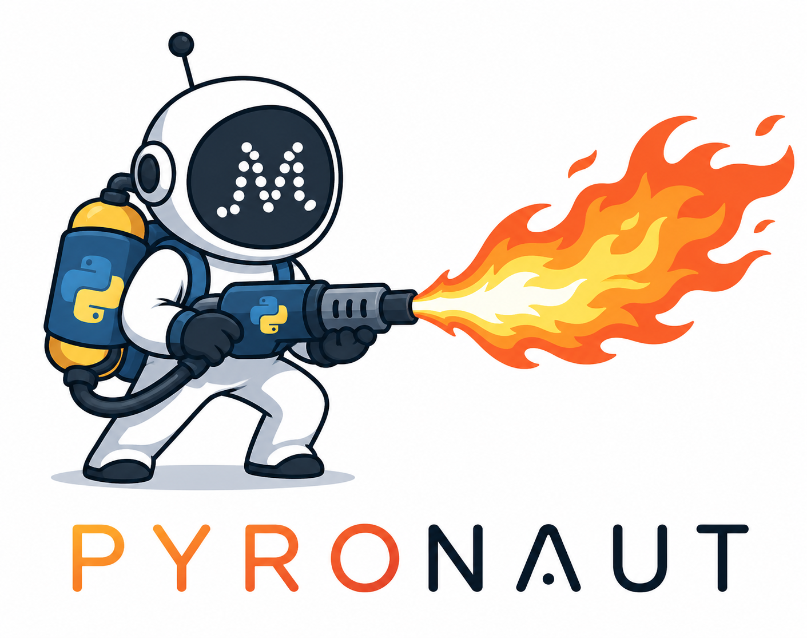

# Pyronaut

Pyronaut brings Micronaut application development to Python code running on
GraalPy. It combines Micronaut dependency injection, configuration, HTTP,
testing, build tooling, and test resources with Python source files and pytest
workflows.

The main user entry point is the `pyronaut` command. The command is a Python
orchestrator that delegates to focused JVM/native tools for dependency
resolution, source processing, application execution, tests, configuration
validation, native builds, and test resources.

## What is in this repository?

This repository contains the Pyronaut CLI and the Micronaut integration modules
that make Python applications work with Micronaut:

- `pyronaut`: the packaged Python CLI orchestrator and SDK wheel.
- `pyronaut-install`: resolves Maven dependencies, writes classpath manifests,
  generates configuration schemas, and creates IDE stubs.
- `pyronaut-processor`: processes Python and Java sources into Micronaut
  metadata/classes.
- `pyronaut-dev`: runs applications in development mode with automatic
  install/process preflight.
- `pyronaut-run` and `pyronaut-test`: run applications and pytest-backed tests.
- `pyronaut-create`: generates new Pyronaut applications from project
  templates.
- `pyronaut-validate-config`: validates Micronaut configuration for run, test,
  and production scenarios.
- `pyronaut-test-resources-server`: manages Micronaut Test Resources for local
  development and tests.
- `pyronaut-native-build`: builds native executables.
- `pyronaut-tui`: interactive terminal UI over the same CLI workflow.
- `pyronaut-projectgen` and `pyronaut-projectgen-app`: project generation
  support.
- `pyronaut-pytest`, `pyronaut-requests`, `pyronaut-logging`, and
  `pyronaut-logback`: runtime and testing support libraries.

The full user guide lives in `src/main/docs/guide`.

## CLI at a glance

```bash
pyronaut [--version] [--tui [--smoke|--non-interactive]] \
  <install|process|dev|run|test|build|create|validate-config|test-resources-server> [args...]
```

Current platform support is macOS and Linux. Commands that delegate to the JVM
require a compatible GraalVM JDK; the CLI can discover local GraalVM
installations or provision configured toolchains.

## Typical project layout

Pyronaut reads project settings from `pyproject.toml`.

Default directories are:

```text
src            Python application sources
tests          Python tests
src-java       optional Java application sources
test-java      optional Java test sources
config         Micronaut application resources
tests-config   Micronaut test resources
__pyronaut__   generated Pyronaut state, reports, caches, and manifests
```

A minimal `pyproject.toml` looks like this:

```toml
[project]
name = "hello-pyronaut"
version = "0.1.0"
dynamic = ["scripts"]

[build-system]
requires = ["setuptools", "wheel", "tomli"]
build-backend = "setuptools.build_meta"

[tool.pyronaut]
repositories = ["mavenCentral"]

[tool.pyronaut.dependencies]
runtime = [
  "io.micronaut:micronaut-http-server-netty",
  "io.micronaut:micronaut-json-core",
  "io.micronaut:micronaut-jackson-databind",
  "ch.qos.logback:logback-classic"
]
build = []
test = [
  "io.micronaut.pyronaut:micronaut-pyronaut-pytest",
  "io.micronaut.test:micronaut-test-junit5",
  "io.micronaut.pyronaut:micronaut-pyronaut-requests"
]
```

Custom source directories can be configured with:

```toml
[tool.pyronaut.sources]
python = "app"
python-test = "test/python"
java = "src/main/java"
java-test = "src/test/java"
resources = "app-config"
test-resources = "tests-config"
additional-resources = ["views", "assets"]
additional-test-resources = ["test-fixtures"]
```

## Minimal application

Create `src/controllers.py`:

```python
from micronaut.http.annotation import Get


@Get(value="/", produces="text/plain")
def index() -> str:
    return "Hello from Pyronaut"
```

Create `config/application.toml`:

```toml
[micronaut.application]
name = "hello-pyronaut"

[micronaut.server]
port = 8080
```

Run the application in development mode:

```bash
pyronaut install
pyronaut process
pyronaut dev
```

`pyronaut dev` performs install/process preflight automatically, so after the
first successful install this is normally enough:

```bash
pyronaut dev
curl http://localhost:8080/
```

## Testing example

Create `tests/test_controller.py`:

```python
import pytest
import requests

from pyronaut.test import MicronautTest, micronaut_test_fixture


@pytest.fixture
def my_context(request):
    fixture = micronaut_test_fixture(request, MicronautTest())
    yield fixture
    fixture.stop()


@pytest.fixture
def client(my_context):
    return requests.with_context(my_context)


def test_index(client):
    response = client.get("/")
    assert response.status_code == 200
    assert response.text == "Hello from Pyronaut"
```

Run tests through Pyronaut so the Micronaut classpath and pytest engine are set
up consistently:

```bash
pyronaut test
```

Reports are written under `__pyronaut__/reports/tests`.

## Common CLI workflows

Resolve dependencies and generate editor support:

```bash
pyronaut install --project-dir /path/to/app
```

Inspect dependency trees without rewriting install manifests:

```bash
pyronaut install --dependencies --scope all --project-dir /path/to/app
```

Process sources:

```bash
pyronaut process --project-dir /path/to/app
pyronaut process --no-cache --project-dir /path/to/app
```

Run or test with lifecycle validation:

```bash
pyronaut dev --project-dir /path/to/app
pyronaut test --project-dir /path/to/app
pyronaut test --tests test_controller.py::test_index --project-dir /path/to/app
```

Skip lifecycle configuration validation explicitly:

```bash
pyronaut dev --no-validate
pyronaut test --no-validate
```

Validate configuration directly:

```bash
pyronaut validate-config --scenario production --format both
pyronaut validate-config --scenario test --env test --validate-dependency-injection
```

Manage a reusable Test Resources server:

```bash
pyronaut test-resources-server start --project-dir /path/to/app
pyronaut test-resources-server status --project-dir /path/to/app
pyronaut test-resources-server stop --project-dir /path/to/app
```

Build deployable artifacts:

```bash
pyronaut build --jvm
pyronaut build --native --main-class example.Application
pyronaut build --docker
pyronaut build --native --docker
pyronaut build --native --docker --static
pyronaut build --native --base-image=default
pyronaut build App.java --native --name hello-java --version 1.0.0
```

Launch the terminal UI:

```bash
pyronaut --tui --project-dir /path/to/app
pyronaut --tui --test --project-dir /path/to/app
```

Trace delegated tool invocations while debugging:

```bash
PYRONAUT_TRACE_DELEGATION=true pyronaut dev --project-dir /path/to/app
```

Disable automatic Test Resources orchestration for `dev` and `test`:

```bash
PYRONAUT_TEST_RESOURCES_DISABLED=true pyronaut test
```

## Building the CLI locally

Build and test the repository:

```bash
./gradlew check
```

Build the Python SDK wheel:

```bash
./gradlew :micronaut-pyronaut:buildSdkWheel
```

Build the native SDK wheel:

```bash
./gradlew :micronaut-pyronaut:buildSdkWheel -Pnative=true
```

Install the local wheel into the active Python environment:

```bash
./gradlew :micronaut-pyronaut:installSdkWheel
pyronaut --help
pyronaut --version
```

Or install the built wheel into a virtual environment:

```bash
python3 -m venv .venv-pyronaut-sdk
source .venv-pyronaut-sdk/bin/activate
python -m pip install --upgrade pip
python -m pip install pyronaut/build/wheel/dist/pyronaut-*.whl
```

The wheel artifacts are written to `pyronaut/build/wheel/dist/`.

## Functional testing

The checked-in fixture application under `functional-test/app` exercises the
local Pyronaut toolchain end to end:

```bash
./gradlew :micronaut-functional-test:test
```

This builds the local launcher distributions, creates a fixture virtual
environment, resolves dependencies, validates configuration, processes sources,
starts test resources, and runs the pytest-backed test flow.

Native-capable tools can be exercised with:

```bash
./gradlew :micronaut-functional-test:test -Pnative=true
```

Functional tests require a GraalPy interpreter, a compatible JDK/GraalVM, and
Docker for Micronaut Test Resources.

### PGO native image build

Oracle GraalVM can build `pyronaut-dev` with profile-guided optimization.
The profile is collected by first building an instrumented native executable,
then running the functional-test workload through that executable, and finally
rebuilding with the generated `.iprof` file.

Build the instrumented native executable:

```bash
./gradlew :micronaut-pyronaut-dev:nativeCompile \
  -PpyronautDevPgoInstrument=true \
  --console=plain
```

Collect the profile by running the native functional tests:

```bash
./gradlew :micronaut-functional-test:test \
  -Pnative=true \
  -PpyronautDevPgoCollect=true \
  --console=plain
```

By default, the profile is written to
`functional-test/build/pgo/pyronaut-dev.iprof`. To use a different location,
set `-PpyronautDevPgoProfileFile=/path/to/pyronaut-dev.iprof` on the functional
test command.

Rebuild the optimized native executable with the collected profile:

```bash
./gradlew :micronaut-pyronaut-dev:nativeCompile \
  -PpyronautDevPgoProfile="$PWD/functional-test/build/pgo/pyronaut-dev.iprof" \
  --console=plain
```

The PGO profile is generated by the instrumented native executable. The regular
JVM functional-test mode does not emit a Native Image `.iprof` profile.

## Documentation

Build the guide:

```bash
./gradlew publishGuide
```

Build the guide and API docs:

```bash
./gradlew docs
```

Open `build/docs/index.html` after the guide build completes.

## More information

- `src/main/docs/guide/gettingStarted.adoc`: guided first application.
- `src/main/docs/guide/pyronautCliV2.adoc`: full CLI reference.
- `pyronaut/README.md`: SDK wheel and orchestrator development notes.
- `functional-test/README.md`: fixture application test workflow.
- `pyronaut-cli-v2/docs/cli-protocol.md`: orchestrator/delegate protocol.
- `CONTRIBUTING.md`: maintainer setup, build, and contribution notes.
